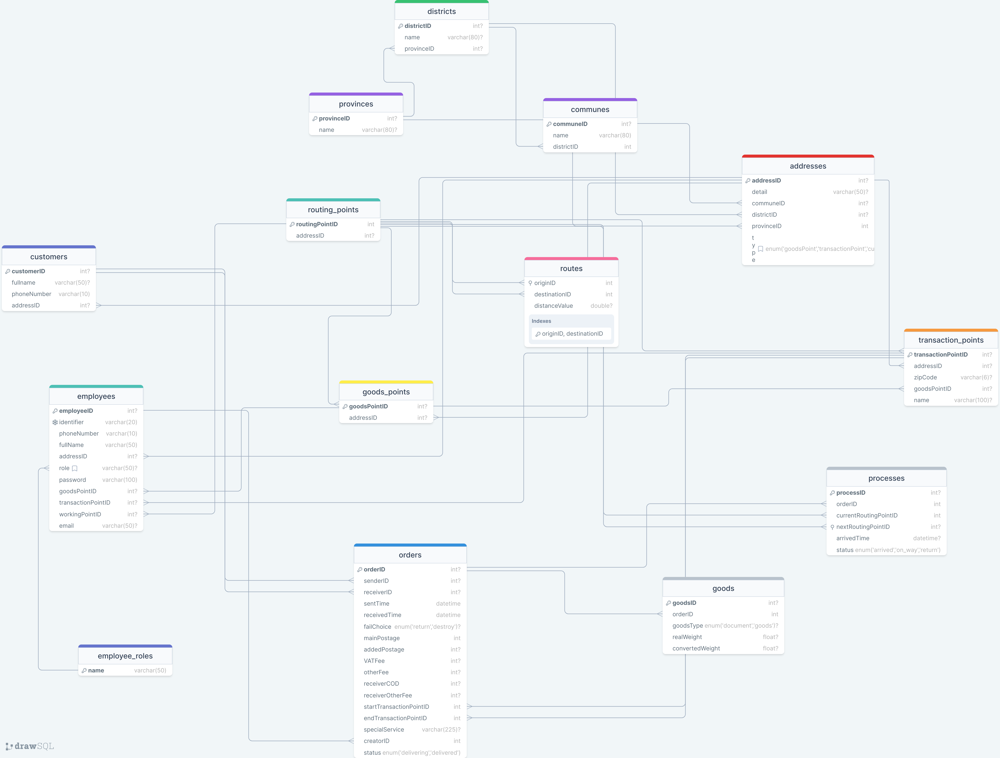

# <samp>MagicPost Node.js server</samp>

## <samp>Table of contents</samp>
- [<samp>Server Information</samp>](#server-information)
- [<samp>Install and run</samp>](#install-and-run)
- [<samp>Error Response JSON Sample and Error codes<samp>](#error-response-json-sample-and-error-codes)
- [<samp>API List</samp>](#api-list)
  - [<samp>Auth API</samp>](#auth-api)
    - [<samp>Log in</samp>](#log-in)
  - [<samp>Employee API</samp>](#employee-api)
    - [<samp>Get all employee roles</samp>](#get-all-employee-roles)
    - [<samp>Get all employees</samp>](#get-all-employees)
    - [<samp>Add new employee</samp>](#add-new-employee)
    - [<samp>Get employee by ID</samp>](#get-employee-by-id)
  - [<samp>Order API</samp>](#order-api)
    - [<samp>Get all orders (with current working address)</samp>](#get-all-orders-with-current-working-address)
    - [<samp>Get order by ID</samp>](#get-order-by-id)
    - [<samp>Create new order</samp>](#create-new-order)
  - [<samp>Transaction Point API</samp>](#transaction-point-api)
    - [<samp>Get transaction point by address</samp>](#get-transaction-point-by-address)
  - [<samp>Address API</samp>](#address-api)
    - [<samp>Get all communes/districts/provinces</samp>](#get-all-communesdistrictsprovinces)
    - [<samp>Get all districts by provinceID</samp>](#get-all-districts-by-provinceid)
    - [<samp>Get all communes by districtID</samp>](#get-all-communes-by-districtid)
- [<samp>Database Design</samp>](#database-design)
  - [<samp>Relation Schema</samp>](#relation-schema)

## <samp>Server Information</samp>

+ <samp>This Node.js application is hosted on <a href="https://dashboard.render.com/"><samp>Render.com<samp></a> with URL <a href = "https://magicpost-uet.onrender.com/">magicpost-uet.onrender.com</a>.</samp>
+ <samp>The database is hosted on <a href="https://console.clever-cloud.com" target="_blank">Clever Cloud console</a>.</samp>
+ <samp>Last Updated: 09/12/2023</samp>
  
## <samp>Install and run</samp>

## <samp>Error Response JSON Sample and Error codes</samp>
```json
{
    "code": "...",
    "error": "...",
    "message": "..."
}
```

| HTTP status code | Error code | Description                                                                               |
| ---------------- | ---------- | ----------------------------------------------------------------------------------------- |
| 400              | 10000      | Invalid Data in Request Body                                                              |
| 409              | 10001      | Invalid Address (CommuneID, DistrictID and ProvinceID are not compatible with each other) |
| 409              | 10002      | Duplicated Identifier                                                                     |

## <samp> API List </samp>

### <samp> Auth API </samp>

#### <samp> Log in </samp>

+ <em>Request JSON Sample</em>

```json
{
    "employeeID": "23000014",
    "password": "password"
}
```

+ <em>Response JSON Sample</em>

```json
{
    "user": {
        "employeeID": 23000014,
        "identifier": "010203090730",
        "phoneNumber": "0123457789",
        "fullName": "Nguyễn Thị Hòa",
        "addressID": 91,
        "role": "TRANSACTION_POINT_EMPLOYEE",
        "email": "email@email.com",
        "workingPointID": 47
    },
    "accessToken": "sample-token"
}
```

### <samp>Employee API</samp>

#### <samp>Get all employee roles</samp>

+ <em> API Information </em>

| Request Requirement</samp> | Content                                                    |
| ------------------- | ----------------------------------------------------------- |
| API URL            | https://magicpost-uet.onrender.com/api/employee/getAllRoles |
| HTTP method         | GET                                                        |
| Token Required      | YES                                                         |
| Roles Authorized    | NONE                                                        |

+ <em>Response JSON Sample</em>
```json
[
    "GOODS_POINT_EMPLOYEE",
    "GOODS_POINT_HEAD",
    "MANAGER",
    "TRANSACTION_POINT_EMPLOYEE",
    "TRANSACTION_POINT_HEAD"
]
```

#### <samp>Get all employees</samp>
+ <em> API Information </em>

| Request Requirement | Content                                                |
| ------------------- | ------------------------------------------------------ |
| API URL             | https://magicpost-uet.onrender.com/api/employee/getall |
| HTTP method         | GET                                                    |
| Token Required      | YES                                                    |
| Roles Authorized    | TRANSACTION_POINT_HEADER                               |

+ <em> Response JSON Sample </em>
```json
[
    {
        "employeeID": 23000000,
        "identifier": "010203000000",
        "phoneNumber": "0123456789",
        "fullName": "Nguyễn Hòa Bình",
        "role": "TRANSACTION_POINT_EMPLOYEE",
        "email": "hoabinhnguyen@gmail.com",
        "workingPointID": 45,
        "address": {
            "province": "Tỉnh Quảng Ninh",
            "district": "Thành phố Uông Bí",
            "commune": "Phường Thanh Sơn",
            "detail": "435 Trần Khánh Dư"
        }
    }
]
```

### Add new employee

| Request Requirement | Content                                             |
| ------------------- | --------------------------------------------------- |
| API URL             | https://magicpost-uet.onrender.com/api/employee/add |
| HTTP method         | GET                                                 |
| Token Required      | YES                                                 |
| Roles Authorized    | TRANSACTION_POINT_HEADER                            |

+ <em> Request JSON Sample </em>
```json
{
    "identifier": "0405899833000",
    "phoneNumber": "0192344559",
    "fullName": "Thái Hoàng Linh",
    "address": {
        "detail": "Số 100, đường 19/4",
        "communeID": "5355",
        "districtID": "302",
        "provinceID": "27" 
    },
    "transactionPointID": null,
    "goodPointID": null,
    "email": "linhhoang@yahoo.com",
    "role": null
}
```
+ <em>Response JSON Sample</em>
```json
{
    "employeeID": 23000042,
    "identifier": "0405899833000",
    "phoneNumber": "0192344559",
    "fullName": "Thái Hoàng Linh",
    "addressID": 171,
    "email": "linhhoang@yahoo.com",
    "password": "YRkLcYuE",
    "role": null,
    "address": {
        "province": "Tỉnh Nghệ An",
        "district": "Huyện Tân Kỳ",
        "commune": "Thị trấn Tân Kỳ",
        "detail": "Số 100, đường 19/4"
    }
}
```

### <samp> Get employee by ID </samp>

+ <em> API Information </em>

| Request Requirement | Content                                                 |
| ------------------- | ------------------------------------------------------- |
| API URL             | https://magicpost-uet.onrender.com/api/employee/:id/get |
| HTTP method         | GET                                                     |
| Token Required      | YES                                                     |
| Roles Authorized    | TRANSACTION_POINT_HEADER                                |

+ <em> Response JSON sample </em>

```json
{
    "employeeID": 23000013,
    "identifier": "010203090030",
    "phoneNumber": "0123457789",
    "fullName": "Hoàng Văn Anh",
    "role": "TRANSACTION_POINT_EMPLOYEE",
    "email": "anhhoang@gmail.com",
    "workingPointID": 46,
    "status": "ACTIVE",
    "createdAt": "2023-12-09T17:05:12.000Z",
    "updatedAt": "2023-12-09T17:05:12.000Z",
    "address": {
        "addressID": 89,
        "detail": "Ngh. 285/35 Đ. Kim Giang",
        "commune": { "communeID": 121, "name": "Phường Kim Giang" },
        "district": { "districtID": 9, "name": "Quận Thanh Xuân" },
        "province": { "provinceID": 1, "name": "Thành phố Hà Nội" }
    },
    "workingPoint": {
        "routingPointID": 46,
        "address": {
            "addressID": 82,
            "commune": { "communeID": 64, "name": "Phường Láng Thượng" },
            "district": { "districtID": 6, "name": "Quận Đống Đa" },
            "province": { "provinceID": 1, "name": "Thành phố Hà Nội" }
        }
    }
}
```

### <samp> Order API </samp>

#### <samp>Get all orders (with current working address)</samp>

+ <em>API Information</em>

| Request Requirement | Content                                                                                        |
| ------------------- | ---------------------------------------------------------------------------------------------- |
| API URL             | https://magicpost-uet.onrender.com/api/order/getall                                            |
| HTTP method         | GET                                                                                            |
| Token Required      | YES                                                                                            |
| Roles Authorized    | TRANSACTION_POINT_EMPLOYEE, TRANSACTION_POINT_HEADER, GOODS_POINT_EMPLOYEE, GOODS_POINT_HEADER |

+ <em>Response JSON Sample</em>
```json
[
    {
        "orderID": "1",
        "sentTime": "2023-11-16T00:05:12.000Z",
        "receivedTime": "2023-11-17T00:05:15.000Z",
        "status": "delivering"
    }
]
```

### <samp>Get order by ID</samp>

+ <em> API Information</em>

| Request Requirement | Content                                              |
| ------------------- | ---------------------------------------------------- |
| API URL             | https://magicpost-uet.onrender.com/api/order/get/:id |
| HTTP method         | GET                                                  |
| Token Required      | YES                                                  |
| Roles Authorized    | TRANSACTION_POINT_EMPLOYEE, TRANSACTION_POINT_HEADER |

+ <em>Response JSON Sample</em>
```json
{
    "order": {
        "sender": {
            "fullname": "Trần Vương Khánh",
            "phoneNumber": "0123456789",
            "address": {
                "detail": "Số 1, đường Xuân Thủy",
                "commune": { "communeID": 57, "name": "Phường Dịch Vọng Hậu" },
                "district": { "districtID": 5, "name": "Quận Cầu Giấy" },
                "province": { "provinceID": 1, "name": "Thành phố Hà Nội" }
            }
        },
        "receiver": {
            "fullname": "Vương Khánh Linh",
            "phoneNumber": "0123456789",
            "address": {
                "detail": "435 Trần Khánh Dư",
                "commune": { "communeID": 2464, "name": "Phường Thanh Sơn" },
                "districtName": { "districtID": 145, "name": "Thành phố Uông Bí" },
                "provinceName": { "provinceID": 14, "name": "Tỉnh Quảng Ninh" }
            }
        },
        "creator": { "creatorID": 23000014, "creatorName": "Nguyễn Thị Hòa" },
        "failChoice": "return",
        "mainPostage": 1000,
        "addedPostage": 1000,
        "VATFee": 1000,
        "otherFee": 1000,
        "receiverCOD": 1000,
        "receiverOtherFee": 1000,
        "specialService": "",
        "orderID": "AEX451934145VN",
        "startTransactionPointID": 47,
        "endTransactionPointID": 46,
        "createdAt": "2023-11-30T13:00:31.000Z",
        "updatedAt": "2023-11-30T13:00:31.000Z"
    },
    "goodsList": [
        { "goodsID": 10, "goodsType": "document", "realWeight": 634, "convertedWeight": 643 }
    ]
}
```

#### <samp> Create new order </samp>

+ <em>API Information</em>

| Request Requirement | Content                                             |
| ------------------- | --------------------------------------------------- |
| API URL             | https://magicpost-uet.onrender.com/api/order/create |
| HTTP method         | POST                                                |
| Token Required      | YES                                                 |
| Roles Authorized    | TRANSACTION_POINT_EMPLOYEE                          |


+ <em>Request JSON Sample</em>

```json
{
    "order": {
        "sender": {
            "fullname": "Hoang Thuy Linh",
            "phoneNumber": "0123456789",
            "address": { "detail": "39S, Street A", "communeID": "121", "districtID": "9", "provinceID": "1" }
        },
        "receiver": {
            "fullname": "Nguyen Huu Minh",
            "phoneNumber": "0123456789",
            "address": { "detail": "43, Street A", "communeID": "121", "districtID": "9", "provinceID": "1" }
        },
        "failChoice": "return",
        "mainPostage": "1000",
        "addedPostage": "1000",
        "VATFee": "1000",
        "otherFee": "1000",
        "receiverCOD": "1000",
        "receiverOtherFee": "1000",
        "specialService": ""
    },
    "goodsList": [
        { "realWeight": "100", "convertedWeight": "25", "goodsType": "goods" }
    ]
}
```

+ <em>Response JSON Sample</em>

```json
{
    "order": {
        "sender": {
            "fullname": "Hoang Thuy Linh",
            "phoneNumber": "0123456789",
            "address": {
                "detail": "39S, Street A", "communeID": "121", "districtID": "9", "provinceID": "1"
            }
        },
        "receiver": {
            "fullname": "Nguyen Huu Minh",
            "phoneNumber": "0123456789",
            "address": {
                "detail": "43, Street A", "communeID": "121", "districtID": "9", "provinceID": "1"
            }
        },
        "failChoice": "return",
        "mainPostage": "1000",
        "addedPostage": "1000",
        "VATFee": "1000",
        "otherFee": "1000",
        "receiverCOD": "1000",
        "receiverOtherFee": "1000",
        "specialService": "",
        "orderID": "UAO124368446VN",
        "startTransactionPointID": 47,
        "endTransactionPointID": "46",
        "creatorID": 23000014,
        "createdAt": "2023-11-30T13:39:12.787Z",
        "updatedAt": "2023-11-30T13:39:12.787Z"
    },
    "goodsList": [
        { "realWeight": "100", "convertedWeight": "25", "goodsType": "goods" }
    ]
}
```

### <samp> Transaction Point API </samp>
#### <samp> Get transaction point by address </samp>

+ <em> API Information </em>

| Request Requirement | Content                                                                                                                      |
| ------------------- | ---------------------------------------------------------------------------------------------------------------------------- |
| API URL             | https://magicpost-uet.onrender.com/api/http://localhost:3000/api/transactionPoint/get/?provinceID=?&districtID=?&communeID=? |
| HTTP method         | GET                                                                                                                          |
| Token Required      | NO                                                                                                                           |
| Roles Authorized    | NONE                                                                                                                         |

+ <em>Response JSON Sample</em>
```json
[
    {
        "address": {
            "detail": "Số 1, đường Xuân Thủy",
            "commune": { "name": "Phường Dịch Vọng Hậu" },
            "district": { "name": "Quận Cầu Giấy" },
            "province": { "name": "Thành phố Hà Nội" }
        }
    }
]
```

### <samp> Address API </samp>
#### <samp> Get all communes/districts/provinces </samp>

+ <em>API Information</em>

| Request Requirement | Content                                                                                                                                                                                                                       |
| ------------------- | ----------------------------------------------------------------------------------------------------------------------------------------------------------------------------------------------------------------------------- |
| API URL             | https://magicpost-uet.onrender.com/api/administrative/province/getall  <br/> https://magicpost-uet.onrender.com/api/administrative/district/getall <br/> https://magicpost-uet.onrender.com/api/administrative/commune/getall |
| HTTP method         | GET                                                                                                                                                                                                                           |
| Token Required      | YES                                                                                                                                                                                                                           |
| Roles Authorized    | NONE                                                                                                                                                                                                                          |
#### Response JSON Sample
```json
[
    { "name":"Thành phố Hà Nội", "provinceID/districtID/communeID": 1 }
]
```
#### <samp> Get all districts by provinceID </samp>

+ <em>API Information</em>

| Request Requirement | Content                                                                           |
| ------------------- | --------------------------------------------------------------------------------- |
| API URL             | https://magicpost-uet.onrender.com/api/administrative/district/getall/:provinceID |
| HTTP method         | GET                                                                               |
| Token Required      | YES                                                                               |
| Roles Authorized    | NONE                                                                              |
#### Response JSON Sample
```json
[
    { "name":"Quận 1","districtID":1474,"provinceID":63 }
]
```
#### <samp> Get all communes by districtID </samp>

+ <em>API Information</em>

| Request Requirement | Content                                                                         |
| ------------------- | ------------------------------------------------------------------------------- |
| API URL             | https://magicpost-uet.onrender.com/api/administrative/commune/getall/:communeID |
| HTTP method         | GET                                                                             |
| Token Required      | YES                                                                             |
| Roles Authorized    | NONE                                                                            |
+ <em>Response JSON sample</em>
```json
[
    { "name":"Phường Phúc Xá","communeID":1,"districtID":1 }
]
```
# <samp> Database Design </samp>

## <samp> Relation Schema </samp>
